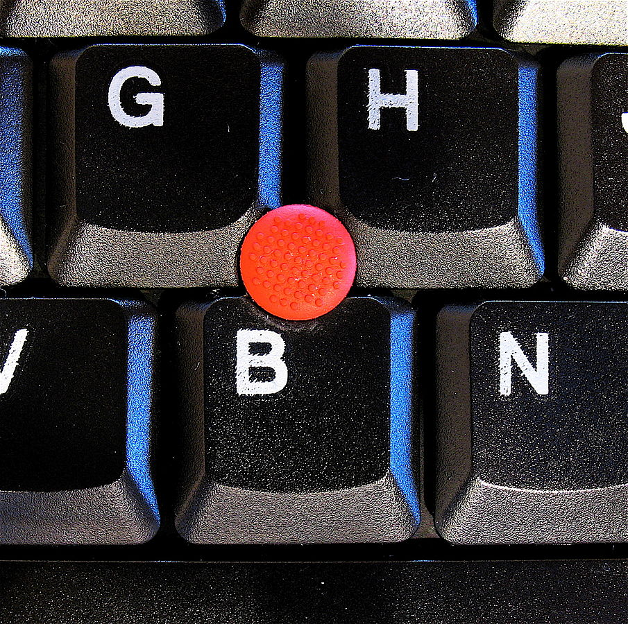

[TrackPoint (or pointing stick) /укр. трекпоінт/](https://uk.wikipedia.org/wiki/%D0%A2%D1%80%D0%B5%D0%BA%D0%BF%D0%BE%D0%B9%D0%BD%D1%82) - тензометричний джойстик, що використовується як вказівний пристрій введення (англ. pointing device) (порівняйте, наприклад, з трекболом чи тачпадом), який дає змогу користувачеві через інтерфейс взаємодіяти з комп'ютером. Також можуть вживатися назви pointing stick, тензометри́чний маніпуля́тор, тензометри́чний джо́йстик.



У моєму Linux ноуті є цей пристрій, активно ним користуюсь, вимкнув ```touchpad```, щоб лишню енергію не споживав :)

Зіткнувся з проблемкою, що курсор на екрані трішки повільно рухається, захотілось швидкості. Раніше це якось налаштовував. Довилось пригадати.

Робимо за допомогою утиліти 

```bash
xinput
```

що входить до пакету

```bash
xorg-xinput
```

Робимо:

```bash
# шукаємо назву свого пристрою (трекпоїнту) 
xinput list

# мій трекпоїнт зареєстрований в системі як
# TPPS/2 IBM TrackPoint id=11

# дивимось властивості й шукаємо де є властивість щодо швидкості курсора
xinput list-props 11

# така річ 'libinput Scrolling Pixel Distance (379): 15'

# збільшуємо цей показник
sudo xinput set-prop 11 379 18 #№379 це id номер самої властивості

```

