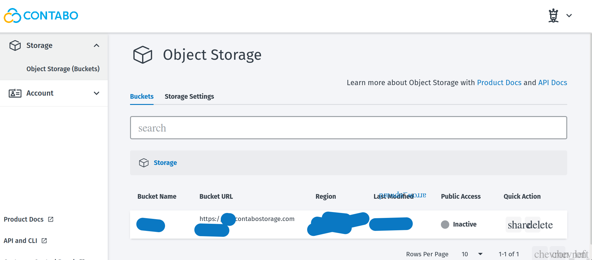
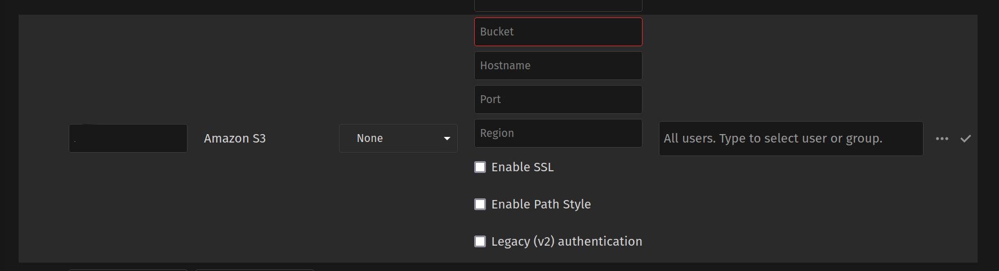

В [Nextcloud](https://nextcloud.com/) є можливість підключити зовнішній диск (block-device), тобто додатковий диск, який десь розміщено в мережі, а також так званий хмарний 'накопичувач об'єктів' ([object storage](https://en.wikipedia.org/wiki/Object_storage)). Стандартні налаштування передбачені для Amazon S3 та OpenStack Object Storage.

Ми додаватимемо хмарний накопичувач об'єктів, який пропонує сервіс [Contabo](https://contabo.com). Цей накопичувач є сумісним з уже стандартним S3 типом накопичувачів, які розроблено та впроваджено компанією амазон.

Без подальшої балаканини, починаймо.

Беремо дані з Contabo Storage Object.

Нас цікавлять такі поля, як `Bucket Name`, `Bucket URL`;  також в розділі меню зліва в `Account` вибираємо `Security & Access` і копіюємо `Access Key` та `Secret Key`.

Використаємо ці дані в _Nextcloud_, зайшовши в налаштування _settings_, вибираємо 'зовнішнє сховище' (`external storage`)  й додаємо Amazon S3

 

Що зазначаємо в цих полях? Зліва від _Amazon S3_ вказуємо назву папки, яка відображатиметься серед усіх папок в **Nextcloud**; з правої сторон від Amazon S3 з випадаючого меню обираємо **Access key**; в полі **Bucket** вказуємо назву з поля `Bucket Name`, далі в полі **Hostname** - `Bucket URL` (але не зазначати _https://_); помічаємо/обираємо **Enable SSL**, **Enable Path Style**;  внизу під _Legacy (v2) authentication_ необхідно внести дані по `Access Key` та `Secret Key`; ставимо "галочку" з крайної правої сторони і все працює. 
